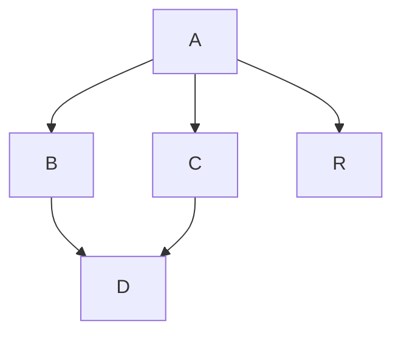

# Commands
dot -Tpng hello.dot -o out.png

dot -Timap -ox.map -Tgif -ox.gif hello.gv

## Graph Genreration 
### Render Mermaid as Markdown

## Markdown -> HTML

marked -i readme.md -o readme.html

marked -o hello.html

